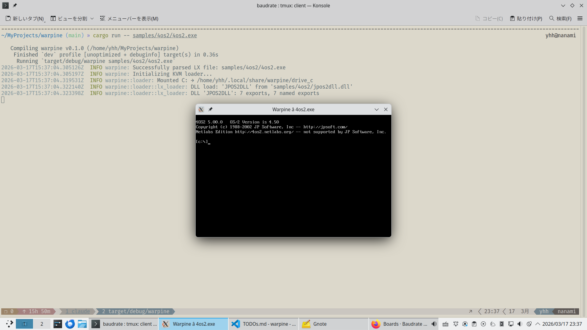

# Warpine: OS/2 Compatibility Layer

> ⚠️ **Experimental — not for production use.** Warpine is a research and hobby project in active development. APIs are incomplete, behaviour may be incorrect, and security has not been hardened. Use at your own risk.

Warpine is a compatibility layer that runs 32-bit OS/2 (LX format) and 16-bit OS/2 1.x (NE format) applications natively on Linux using KVM hardware virtualization. Analogous to WINE for Windows, but targeting OS/2 instead.



## Key Features

- **LX Executable Parser:** Full support for LX headers, object tables, page maps, fixups, resource tables, import tables, entry tables, and non-resident names tables.
- **KVM Hypervisor:** Custom VMM executing 32-bit OS/2 code at native speed via hardware-accelerated virtualization.
- **API Thunking:** System call interception via `INT 3` traps bridging guest OS/2 calls to host Rust implementations. Covers DOSCALLS, PMWIN, PMGPI, KBDCALLS, VIOCALLS, NLS, MDM (MMPM/2), and UCONV — 269 entry points total.
- **DLL Loader Chain:** Runtime dynamic loading via `DosLoadModule` / `DosQueryProcAddr` / `DosQueryModuleHandle`. User DLLs are loaded into guest memory with rebased objects and export maps. `jpos2dll.dll` (4OS2 extension) loads and resolves all 7 exports at startup.
- **Multi-Threading:** OS/2 threads mapped 1:1 to host threads, each with its own KVM vCPU.
- **Presentation Manager (GUI):** Window management, message loop, graphics primitives, timers, clipboard, dialogs, menus, and resource loading via SDL2.
- **SDL2 VGA Text Renderer:** 640×400 text-mode window with CP437 8×16 font, CGA 16-colour palette, and blinking cursor. CLI apps default to this mode; `WARPINE_HEADLESS=1` falls back to terminal.
- **Text-Mode Console:** Full VIO and KBD subsystem emulation with screen buffer, cursor management, scroll, and keyboard input.
- **Filesystem:** HPFS-compatible VFS (`VfsBackend` trait) with `HostDirBackend`: case-insensitive lookup, extended attributes (xattrs + sidecar), file locking, OS/2 wildcard matching, sandbox isolation. C: drive auto-mounted at `~/.local/share/warpine/drive_c/`.
- **Memory Management:** `DosAllocMem`/`DosFreeMem`, shared memory, guest physical memory manager.
- **IPC:** Event/mutex/muxwait semaphores, pipes, and named message queues.
- **Process Management:** `DosExecPgm`, `DosWaitChild`, directory tracking, system information queries.
- **NLS:** `DosQueryCtryInfo`, `DosQueryCp`, `DosMapCase`, `DosGetDateTime` — verified correct.
- **MMPM/2 Audio:** `DosBeep` plays real sine-wave tones; `mciSendCommand`/`mciSendString` for `waveaudio` devices via SDL2 audio queue.
- **NE Format Execution:** Full NE (New Executable) loader and 16-bit execution — loads OS/2 1.x 16-bit NE binaries into GDT-tiled guest memory, dispatches DOSCALLS/VIOCALLS via Pascal-convention 16-bit thunks. `ne_hello` (pure assembly, no Watcom CRT) runs `DosWrite`+`DosExit` correctly.
- **GDB Remote Stub:** `--gdb <port>` enables GDB RSP over TCP — attach with `gdb`/`gef`/`pwndbg` for software breakpoints, single-step, and full register/memory access.
- **Crash Dump Facility:** Structured crash reports on fatal VMEXITs — registers, stack, code bytes, and last 256 API calls written to `warpine-crash-<pid>.txt`.
- **Builtin CMD.EXE Shell:** Native Rust command shell. `cargo run -- CMD.EXE` opens a 640×400 SDL2 VGA text window (same as any CLI app); `WARPINE_HEADLESS=1` falls back to the host terminal. Also intercepts `DosExecPgm("CMD.EXE")` from running OS/2 guests. No Open Watcom or 4OS2 required. Built-in commands: `DIR`, `CD`, `SET`, `ECHO`, `CLS`, `VER`, `TYPE`, `MD`, `RD`, `DEL`, `HELP`, `EXIT`. Line editor with history (↑/↓). `.CMD` script interpreter.
- **API Compatibility Report:** `warpine --compat` prints a module-grouped report of all implemented APIs with stub annotations.

## Architecture

```
src/
  main.rs              Entry point, format detection (LX/NE), CLI/PM/SDL2 dispatch
  lx/                  LX executable format parser (header, entry table, non-resident names)
  ne/                  NE (16-bit) executable format parser
  gui/                 SDL2 backends: PmRenderer, Sdl2Renderer, HeadlessRenderer,
                         Sdl2TextRenderer, HeadlessTextRenderer, run_pm_loop, run_text_loop
  loader/
    mod.rs             Loader, SharedState (all managers + DllManager), KVM setup
    vcpu.rs            vCPU thread: VMEXIT loop, GDB integration, crash dump hooks
    vm_backend.rs      VmBackend/VcpuBackend traits (KVM + mock implementations)
    kvm_backend.rs     KVM-based VmBackend implementation
    guest_mem.rs       GuestMemory: safe typed read/write into KVM guest memory
    lx_loader.rs       LX/DLL loading: load(), load_dll(), find_dll_path(), apply_fixups()
    ne_exec.rs         NE executable loader: load_ne(), setup_guest_ne(), handle_ne_api_call(), ne_api_arg_bytes()
    descriptors.rs     GDT/IDT setup, resolve_import() (built-ins + DllManager)
    constants.rs       Named constants: MAGIC_API_BASE, ordinal bases, TIB/PIB addresses
    api_registry.rs    Static sorted API thunk table (142 entries); compat_report()
    api_dispatch.rs    Ordinal → handler dispatch + sub-dispatcher routing
    api_trace.rs       ordinal_to_name(), module_for_ordinal() for structured tracing
    api_ring.rs        256-entry API call ring buffer for crash post-mortem
    crash_dump.rs      Structured crash reports on fatal VMEXITs
    gdb_stub.rs        GDB Remote Stub: RSP over TCP, breakpoints, single-step
    doscalls.rs        DOSCALLS API implementations
    viocalls.rs        VIOCALLS (Video I/O) implementations
    kbdcalls.rs        KBDCALLS (Keyboard) implementations
    pm_win.rs          PMWIN (Window Manager) implementations
    pm_gpi.rs          PMGPI (Graphics) implementations
    pm_types.rs        PM data types (windows, classes, WindowManager)
    mmpm.rs            MMPM/2 audio: MmpmManager, beep_tone, mciSendCommand/String
    console.rs         VioManager: screen buffer, cursor, raw/SDL2 mode, ANSI output
    process.rs         Process execution and directory tracking
    managers.rs        MemoryManager, HandleManager, DllManager, LoadedDll, and more
    stubs.rs           DosLoadModule, DosQueryProcAddr, and other API implementations
    ipc.rs             Semaphores, pipes, and queues
    vfs.rs             VfsBackend trait, DriveManager, OS/2 filesystem types
    vfs_hostdir.rs     HostDirBackend: HPFS-on-host-directory implementation
    locale.rs          Os2Locale: country/codepage information
    mutex_ext.rs       MutexExt trait (poison-recovering lock)
samples/               OS/2 sample applications and build scripts
  hello/               DosWrite "Hello" — basic smoke test
  alloc_test/          DosAllocMem/DosFreeMem round-trip
  4os2/                4OS2 command shell (fetch_source.sh + make; includes jpos2dll.dll)
  pm_demo/             Presentation Manager GUI demo
  pm_hello/            Minimal PM "Hello World" window
  shapes/              PM graphics: boxes, lines, arcs
  thread_test/         DosCreateThread/DosWaitThread
  pipe_test/           DosCreatePipe/DosWrite/DosRead
  mutex_test/          DosCreateMutexSem recursive locking
  muxwait_test/        DosCreateMuxWaitSem multi-semaphore wait
  queue_test/          DosCreateQueue/DosWriteQueue/DosReadQueue
  ipc_test/            Combined IPC exerciser (semaphores + pipes)
  thunk_test/          TIB/PIB layout, DosGetInfoBlocks, DosQuerySysInfo
  nls_test/            DosQueryCtryInfo, DosQueryCp, DosMapCase
  file_test/           DosOpen/Read/Write/Close file I/O
  dir_test/            DosCreateDir/DeleteDir/FindFirst directory ops
  find_test/           DosFindFirst/Next wildcard search
  findbuf_test/        DosFindFirst multi-entry buffer packing
  fs_ops_test/         Filesystem operations (move, delete, attribs)
  vfs_test/            VFS subsystem integration test
  screen_test/         VIO screen buffer and cursor operations
  ne_hello/            NE (16-bit) format hello world
  dbcs_test/           DBCS VIO cell classification and lead-byte query
  uconv_test/          UCONV.DLL Unicode conversion round-trip
  audio_test/          MMPM/2 audio: DosBeep and mciSendString
  pm_controls_test/    PM built-in controls (WC_BUTTON, WC_STATIC, WC_ENTRYFIELD, etc.)
```

See [doc/developer_guide.md](doc/developer_guide.md) for detailed internals documentation and [doc/reference_manual.md](doc/reference_manual.md) for the user reference manual.

## Prerequisites

- **CPU:** x86_64 with virtualization support (VT-x or AMD-V enabled).
- **OS:** Linux with KVM support (`/dev/kvm` must be accessible by the user).
- **Toolchain:** Rust (Edition 2024).
- **Library:** `libsdl2-dev` (for PM/GUI window and audio support).
- **Optional (for samples):** Open Watcom v2 — `./vendor/setup_watcom.sh` to vendor it.

## Contributing

### Git Hooks

This repo ships a pre-commit hook that runs `cargo test` and `cargo clippy -- -D warnings` before every commit. Activate it once after cloning:

```bash
git config core.hooksPath githooks
```

The hook will abort the commit if any test fails or if there are clippy warnings.

## Getting Started

### 1. Build Warpine
```bash
cargo build
```

### 2. Build sample OS/2 applications
```bash
./vendor/setup_watcom.sh              # Download Open Watcom compiler (once)
make -C samples/hello                 # Simple "Hello, OS/2!" CLI app
make -C samples/alloc_test            # Memory allocation test
make -C samples/pm_demo               # Presentation Manager GUI demo
```

### 3. Run an OS/2 binary
```bash
cargo run -- samples/hello/hello.exe        # CLI app (SDL2 text window)
cargo run -- samples/pm_demo/pm_demo.exe    # GUI app

WARPINE_HEADLESS=1 cargo run -- samples/hello/hello.exe   # Terminal fallback
```

### 4. Run the builtin CMD.EXE shell
```bash
cargo run -- CMD.EXE                       # Interactive shell (SDL2 text window)
WARPINE_HEADLESS=1 cargo run -- CMD.EXE   # Terminal/headless mode
cargo run -- CMD.EXE /C "ECHO Hello!"     # Run one command and exit
cargo run -- CMD.EXE /K "VER"             # Run one command then stay interactive
```

### 5. Run 4OS2 (full-featured OS/2 command shell)
```bash
cd samples/4os2 && ./fetch_source.sh && make && cd ../..
cargo run -- samples/4os2/4os2.exe
```

### 7. API compatibility report
```bash
cargo run -- --compat
```

### 8. Tracing

`RUST_LOG` controls log verbosity. `WARPINE_TRACE` controls output format:

```bash
RUST_LOG=debug cargo run -- samples/hello/hello.exe
WARPINE_TRACE=strace RUST_LOG=debug cargo run -- samples/hello/hello.exe  # strace-like
WARPINE_TRACE=json   RUST_LOG=debug cargo run -- samples/hello/hello.exe  # JSON lines
```

### 9. GDB debugging
```bash
cargo run -- --gdb 1234 samples/hello/hello.exe   # Start with GDB stub on port 1234
# In another terminal:
gdb -ex 'target remote :1234'                      # Attach with GDB
```

### 10. Run tests and lint
```bash
cargo test                        # 466 unit tests (no KVM required)
cargo test --test integration     # 9 end-to-end tests (requires /dev/kvm)
cargo clippy -- -D warnings       # Lint — must pass with zero warnings
```

## Status

| Phase | Description | Status |
|-------|-------------|--------|
| 1 | Foundation — LX parser, KVM loader, basic API thunks | ✅ Complete |
| 2 | Core Subsystem — memory, filesystem, threading, IPC, process management | ✅ Complete |
| 3 | Presentation Manager — window management, graphics, input, timers, SDL2 | ✅ Complete |
| 3.5 | Text-Mode Application Support — VIO/KBD console, 4OS2 shell | ✅ Complete |
| 4 | HPFS-Compatible VFS — VfsBackend, HostDirBackend, EA, file locking | ✅ Complete |
| 4.5 | 16-bit Thunk Fix — eliminated 16-bit thunks in 4OS2 via recompilation | ✅ Complete |
| 5 | Multimedia & 16-bit — MMPM/2 audio baseline; NE parser + full 16-bit NE execution | ✅ Complete |
| 6 | SDL2 VGA Text Renderer — 640×400 CP437 window, CGA palette, blinking cursor | ✅ Complete |
| 7 | Application Compatibility — DLL loader chain baseline (jpos2dll.dll) | 🔄 In progress |
| 8 | SOM / Workplace Shell | 🔮 Long-term |
| 9 | XE — 64-bit OS/2-lineage platform (new format + API set + Rust toolchain) | 🔮 Far future |

See [doc/TODOs.md](doc/TODOs.md) for the detailed roadmap.

## License

This project is licensed under the GNU General Public License v3.0 only (GPL-3.0-only). See the [LICENSE](LICENSE) file for details.
