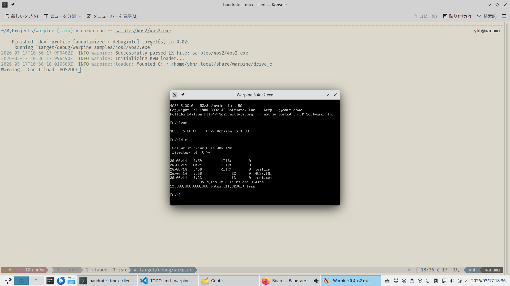

# Warpine: OS/2 Compatibility Layer

Warpine is a compatibility layer that runs 32-bit OS/2 (LX format) applications natively on Linux using KVM hardware virtualization. Analogous to WINE for Windows, but targeting OS/2 instead.



## Key Features

- **LX Executable Parser:** Full support for parsing Linear Executable (LX) headers, object tables, page maps, fixups (relocations), resource tables, and import/export tables.
- **KVM Hypervisor:** A custom Virtual Machine Monitor (VMM) that executes 32-bit OS/2 code at native speeds using hardware-accelerated virtualization.
- **API Thunking:** System call interception using `INT 3` traps to bridge guest OS/2 calls to host Rust implementations. Supports DOSCALLS, PMWIN, PMGPI, KBDCALLS, VIOCALLS, NLS, and MDM (MMPM/2).
- **Multi-Threading:** Concurrent OS/2 threads, each mapped to a native host thread with its own KVM vCPU.
- **Presentation Manager (GUI):** Window management, message loop, graphics primitives, timer support, clipboard, dialog boxes, menus, and resource loading — implemented via SDL2.
- **Text-Mode Console:** Full VIO (Video I/O) and KBD (Keyboard) subsystem emulation via ANSI terminal escape sequences and termios raw mode.
- **Filesystem Support:** HPFS-compatible virtual filesystem (`VfsBackend` trait) with `HostDirBackend`: case-insensitive lookup, extended attributes (xattrs + sidecar), file locking, OS/2 wildcard matching, and sandbox isolation.
- **Memory Management:** `DosAllocMem`/`DosFreeMem`, shared memory, and a dedicated guest physical memory manager.
- **IPC:** Event/mutex/muxwait semaphores, pipes, and named message queues.
- **Process Management:** `DosExecPgm`, `DosWaitChild`, directory tracking, and system information queries.
- **MMPM/2 Audio:** `DosBeep` plays real sine-wave tones; `mciSendCommand`/`mciSendString` for `waveaudio` devices via SDL2 audio queue.
- **NE Format Parser:** Parser for OS/2 1.x 16-bit (NE) executables — foundation for future 16-bit support.

## Architecture

```
src/
  main.rs              Entry point, CLI/PM detection, SDL2 init
  gui.rs               SDL2 GUI: event loop, Canvas/Texture rendering, input dispatch
  api.rs               DosWrite/DosExit FFI bridge stubs
  font8x16.rs          8x16 bitmap font for text rendering
  lx/                  LX executable format parser
  ne/                  NE (16-bit) executable format parser
  loader/
    mod.rs             Loader struct, SharedState, KVM setup, VMEXIT loop
    api_dispatch.rs    OS/2 API dispatch (ordinal → handler)
    api_trace.rs       Structured tracing helpers (ordinal_to_name, module_for_ordinal)
    constants.rs       Named constants (addresses, message IDs, ordinal bases)
    doscalls.rs        DOSCALLS API implementations
    viocalls.rs        VIOCALLS (Video I/O) implementations
    kbdcalls.rs        KBDCALLS (Keyboard) implementations
    pm_win.rs          PMWIN (Window Manager) implementations
    pm_gpi.rs          PMGPI (Graphics) implementations
    mmpm.rs            MMPM/2 audio: MmpmManager, beep_tone, mciSendCommand/String
    console.rs         VioManager: screen buffer, cursor, raw mode, ANSI output
    process.rs         Process execution and directory tracking
    managers.rs        Memory, handle, resource managers
    stubs.rs           Stub handlers for unimplemented APIs
    ipc.rs             Semaphores and queues
    vfs.rs             VfsBackend trait, DriveManager, OS/2 filesystem types
    vfs_hostdir.rs     HostDirBackend: HPFS-on-host-directory implementation
    locale.rs          Os2Locale: country/codepage information
    guest_mem.rs       Guest memory read/write helpers
    vm_backend.rs      VmBackend/VcpuBackend traits (KVM + mock implementations)
samples/               Example OS/2 applications and build scripts
build.rs               Linker search path for libSDL2 (via pkg-config)
```

See [doc/developer_guide.md](doc/developer_guide.md) for detailed internals documentation.

## Prerequisites

- **CPU:** x86_64 with virtualization support (VT-x or AMD-V enabled).
- **OS:** Linux with KVM support (`/dev/kvm` must be accessible by the user).
- **Toolchain:** Rust (Edition 2024).
- **Library:** `libsdl2-dev` (for PM/GUI window support and audio).
- **Optional (for samples):** Open Watcom v2 (can be vendored using `vendor/setup_watcom.sh`).

## Getting Started

### 1. Build Warpine
```bash
cargo build
```

### 2. Build sample OS/2 applications
```bash
./vendor/setup_watcom.sh          # Download Open Watcom compiler
make -C samples/hello             # Simple "Hello, OS/2!" CLI app
make -C samples/alloc_test        # Memory allocation test
make -C samples/file_test         # File I/O test
make -C samples/pm_demo           # Presentation Manager GUI demo
```

### 3. Run an OS/2 binary
```bash
cargo run -- samples/hello/hello.exe        # CLI app
cargo run -- samples/pm_demo/pm_demo.exe    # GUI app
```

### 4. Run 4OS2 (interactive OS/2 command shell)
```bash
cd samples/4os2 && ./fetch_source.sh && make && cd ../..
cargo run -- samples/4os2/4os2.exe
```

### 5. Tracing

`RUST_LOG` controls log verbosity. `WARPINE_TRACE` controls the output format:

```bash
RUST_LOG=debug cargo run -- samples/hello/hello.exe        # Full API call trace
WARPINE_TRACE=strace RUST_LOG=debug cargo run -- samples/hello/hello.exe  # strace-like compact format
WARPINE_TRACE=json   RUST_LOG=debug cargo run -- samples/hello/hello.exe  # JSON lines for tooling
```

### 6. Run tests
```bash
cargo test
```

## Status

- **Phase 1** (Foundation) — Complete. LX parser, KVM loader, basic API thunks.
- **Phase 2** (Core Subsystem) — Complete. Memory, filesystem, threading, IPC, process management.
- **Phase 3** (Presentation Manager GUI) — Complete. Window management, graphics, input, timers, dialogs, menus, clipboard, resource loading via SDL2.
- **Phase 3.5** (Text-Mode Application Support) — Complete. VIO/KBD console subsystem. 4OS2 command shell runs interactively.
- **Phase 4** (HPFS-Compatible VFS) — Complete. `VfsBackend` trait, `HostDirBackend` with case-insensitive lookup, extended attributes, file locking, sandbox isolation.
- **Phase 4.5** (16-bit Thunk Fix) — Complete. Eliminated 16-bit thunks in 4OS2 via source-level recompilation (patches in `samples/4os2/patches/`).
- **Phase 5** (Multimedia & 16-bit) — In progress. MMPM/2 audio baseline done (`DosBeep`, `mciSendCommand`/`mciSendString` for waveaudio). NE format parser complete. NE loader/execution planned.

See [doc/TODOs.md](doc/TODOs.md) for the full roadmap.

## License

This project is licensed under the GNU General Public License v3.0 only (GPL-3.0-only). See the [LICENSE](LICENSE) file for details.
